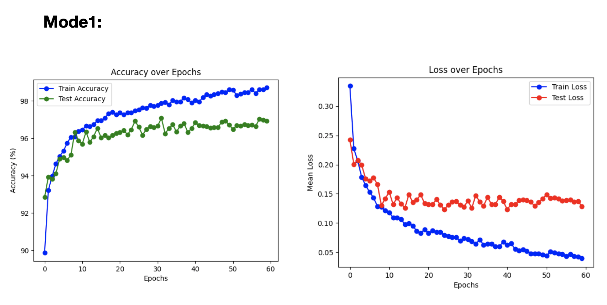
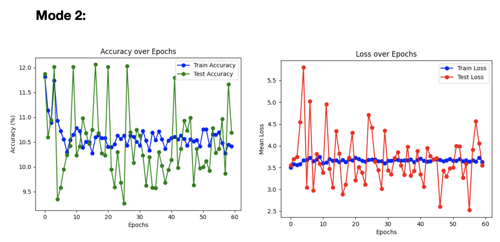
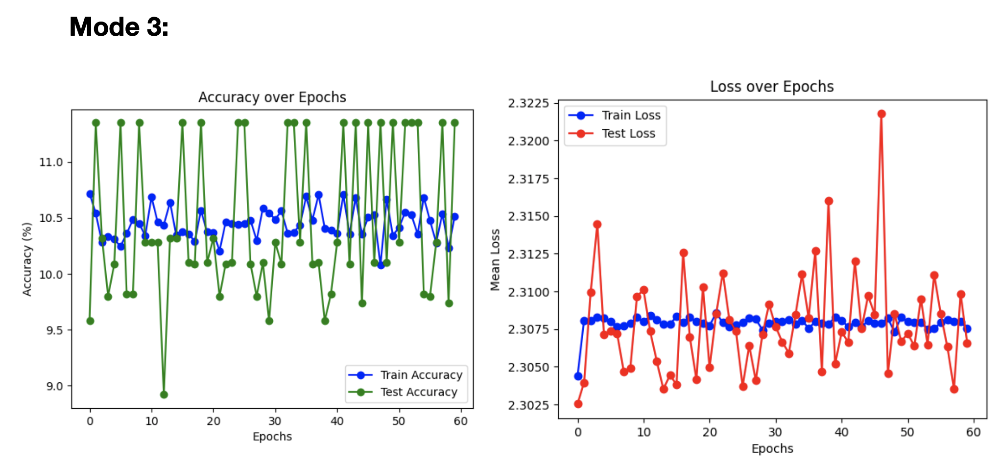
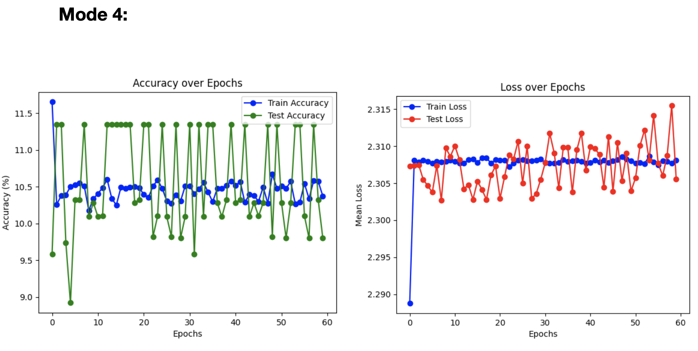
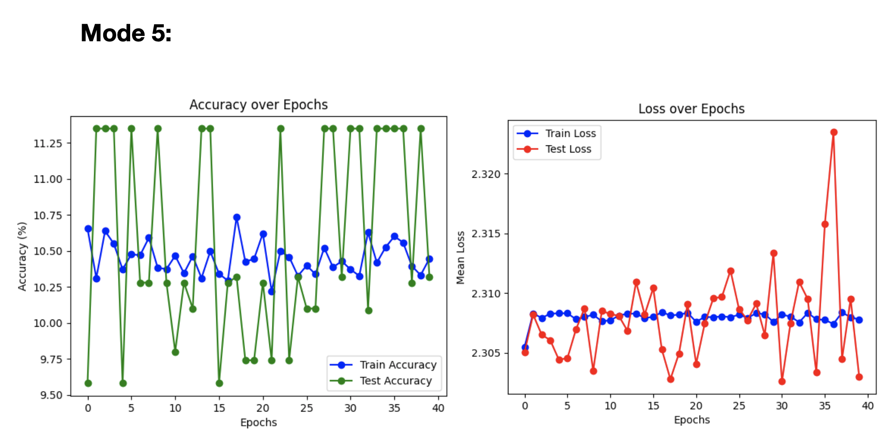

# Pytorch Model Architecture Tuning
This repo tries to evalute the impact of varying convolutional network architectures on network's performance.
We compares five different models and analyses their convergence and training for MNIST digit classification dataset.
Architectures of these five models are described as under.

<h3>Steps to create Models</h3>

1. Create a fully connected (FC) hidden layer (with 100 neurons) with sigmoid activation function. Train it with SGD with a learning rate of 0.1 (a total of 60 epoch), a mini-batch size of 10, and no regularization.
2. Now insert two convolutional layers to the network built in STEP 1 (and put pooling layer too for each convolutional layer). Pool over 2x2 regions, 40 kernels, stride =1, with kernel size of 5x5.
3. For the network depicted in STEP 2, replace Sigmoid with ReLU, and train the model with new learning rate (=0.03). Re-train the system with this setting.
4. Add another fully connected (FC) layer now (with 100 neurons) to the network built in STEP 3. (remember that the first FC was put in STEP 1, here you are putting just another FC).
5. Change the neurons numbers in FC layers into 1000. For regularization, use Dropout (with a rate of 0.5). Train the whole system using 40 epochs.

<h3> Models' Performance </h3>
 

  For mode 1 the loss descended for each epoch and accuracy got better, as expected but for every other mode which had an added convolution layer didn’t converged. For different optimisers and loss functions, mode 2-5 didn’t let the model converge and the loss and accuracy didn’t show improvement as the model was trained with the given settings.
 

 

 Conclusion: MNIST is a simple dataset and single fully connected layer with sigmoid does good but the other complex architectures were not converging because of a possible bug in implementation or some other logical cause.
 

 

</img>
</img>
</img>
</img> 
</img> 

